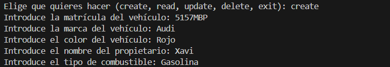
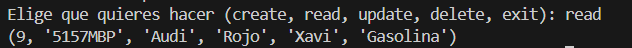
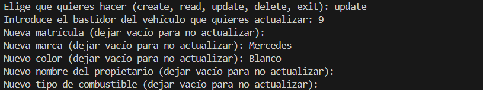
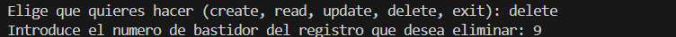

# Activitat POSTGRES CRUD

## Crear un registre

Es crea un registre que demana la matricula del vehicle, la marca, el color, el nom del propietari y el combustible

## Llegir els registres

Es mostres tots els registres de la base de dades

## Modificar un registre

El sistema et demana que fiquis els valors que vols modificar dels camps, si hi ha algun camp que no es vol modificar ho deixem buit

## Eliminar un registre

Tenim que indicar el numero de bastidor del vehicle per eliminar el registre